# 電子カルテ (emr) ユーザーマニュアル

## 目次

1. [はじめに](#はじめに)
2. [画面構成](#画面構成)
3. [患者管理](#患者管理)
   - [患者の新規登録](#患者の新規登録)
   - [患者一覧と検索](#患者一覧と検索)
   - [患者情報の編集](#患者情報の編集)
   - [患者の削除](#患者の削除)
4. [カルテ（診療記録）](#カルテ診療記録)
   - [SOAP記録の入力](#soap記録の入力)
   - [バイタルサインの入力](#バイタルサインの入力)
   - [写真添付](#写真添付)
   - [記録の保存と確認](#記録の保存と確認)
5. [処方管理](#処方管理)
   - [処方の入力](#処方の入力)
   - [処方履歴](#処方履歴)
6. [検査結果](#検査結果)
   - [検査結果の入力](#検査結果の入力)
   - [検査結果一覧](#検査結果一覧)
   - [カテゴリフィルタ](#カテゴリフィルタ)
7. [診療履歴](#診療履歴)
8. [設定](#設定)
   - [データ管理（エクスポート/インポート）](#データ管理エクスポートインポート)
   - [AI診断設定](#ai診断設定)
9. [データの保存について](#データの保存について)

---

## はじめに

本アプリケーションは、ブラウザ上で動作するオフライン対応の電子カルテシステムです。患者情報、診療記録（SOAP）、処方、検査結果を一元管理できます。

**主な特徴：**
- インターネット接続不要（オフライン動作）
- データはブラウザ内（IndexedDB）に保存
- PWA対応（ホーム画面に追加可能）
- JSON形式でのデータエクスポート/インポート
- AI診断支援（OpenAI API連携、オプション）

---

## 画面構成

アプリは上部のタブで画面を切り替えます。

| タブ | 機能 |
|------|------|
| 📋 患者 | 患者の登録・検索・編集・削除 |
| 🩺 カルテ | SOAP記録・バイタルサイン・写真添付 |
| 💊 処方 | 処方の入力・履歴管理 |
| 🔬 検査 | 検査結果の入力・一覧・推移グラフ |
| 📅 履歴 | 診療記録のタイムライン表示 |
| ⚙️ 設定 | データ管理・AI設定・バージョン情報 |

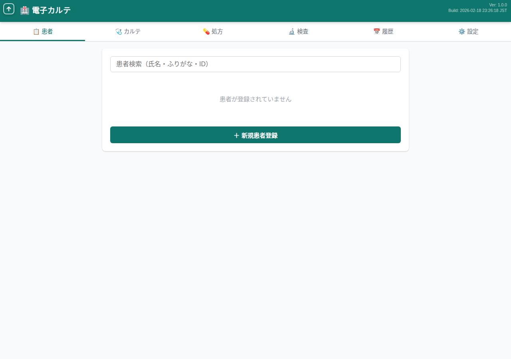
*起動直後の画面。患者タブが表示されます。*

---

## 患者管理

### 患者の新規登録

1. 患者タブの「＋ 新規患者登録」ボタンをクリックします。

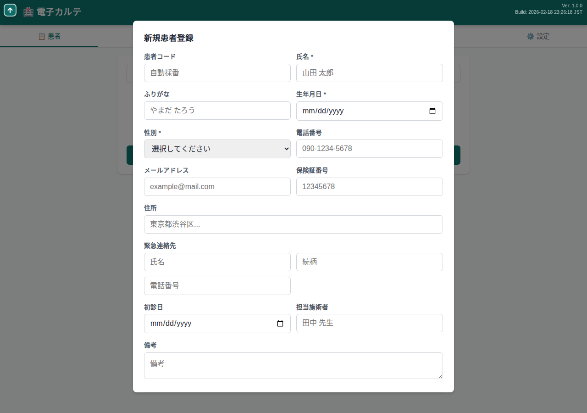
*患者登録フォームが表示されます。*

2. 必要な情報を入力します。

| 項目 | 必須 | 説明 |
|------|------|------|
| 患者コード | - | 空欄の場合は自動採番（P0001〜） |
| 氏名 | 必須 | 患者のフルネーム |
| ふりがな | - | 検索に使用 |
| 生年月日 | 必須 | 年齢が自動計算されます |
| 性別 | 必須 | 男性 / 女性 / その他 |
| 電話番号 | - | ハイフン区切り推奨 |
| メール | - | メールアドレス |
| 保険証番号 | - | 保険証の記号・番号 |
| 住所 | - | 住所 |
| 初診日 | - | 初回来院日 |
| 担当医 | - | 担当医師名 |
| 備考 | - | 自由記述 |

3. アレルギー情報・既往歴は「＋ アレルギーを追加」「＋ 既往歴を追加」ボタンで項目を追加できます。

4. 写真（患者写真など）もドラッグ&ドロップまたはファイル選択で添付可能です（最大5枚）。

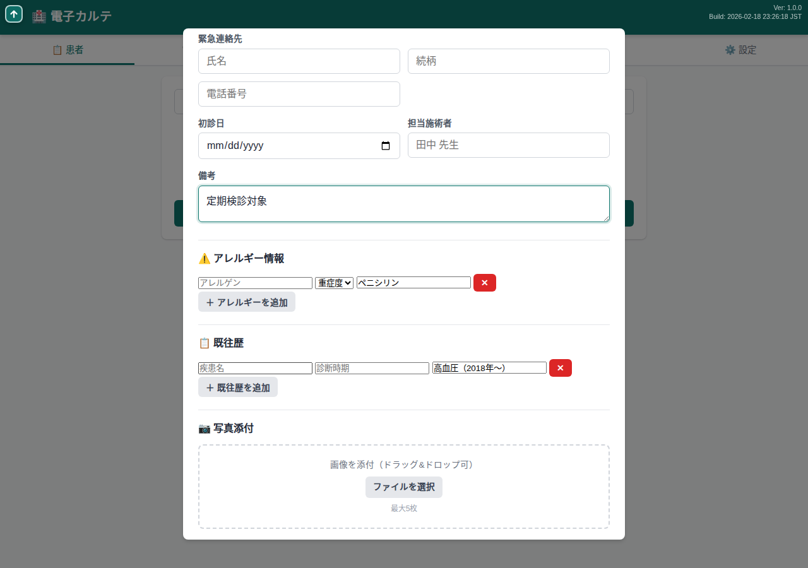
*必要事項を入力した状態。*

5. 「保存」ボタンをクリックすると患者が登録されます。

### 患者一覧と検索

登録した患者は患者タブに一覧表示されます。各患者カードには患者コード、氏名、年齢、性別が表示されます。

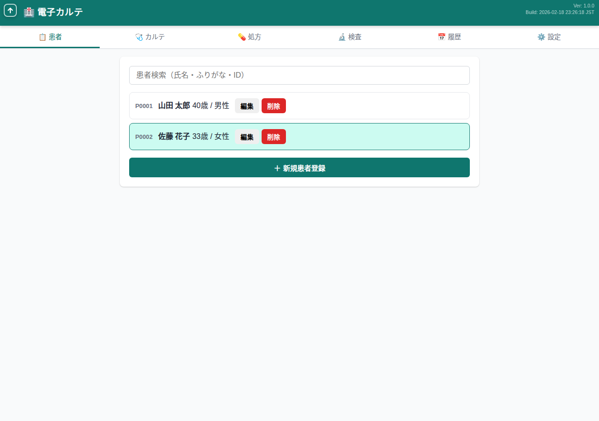
*登録済み患者の一覧。「編集」「削除」ボタンが表示されます。*

上部の検索バーに文字を入力すると、氏名・ふりがな・患者コードでリアルタイムに絞り込みできます。

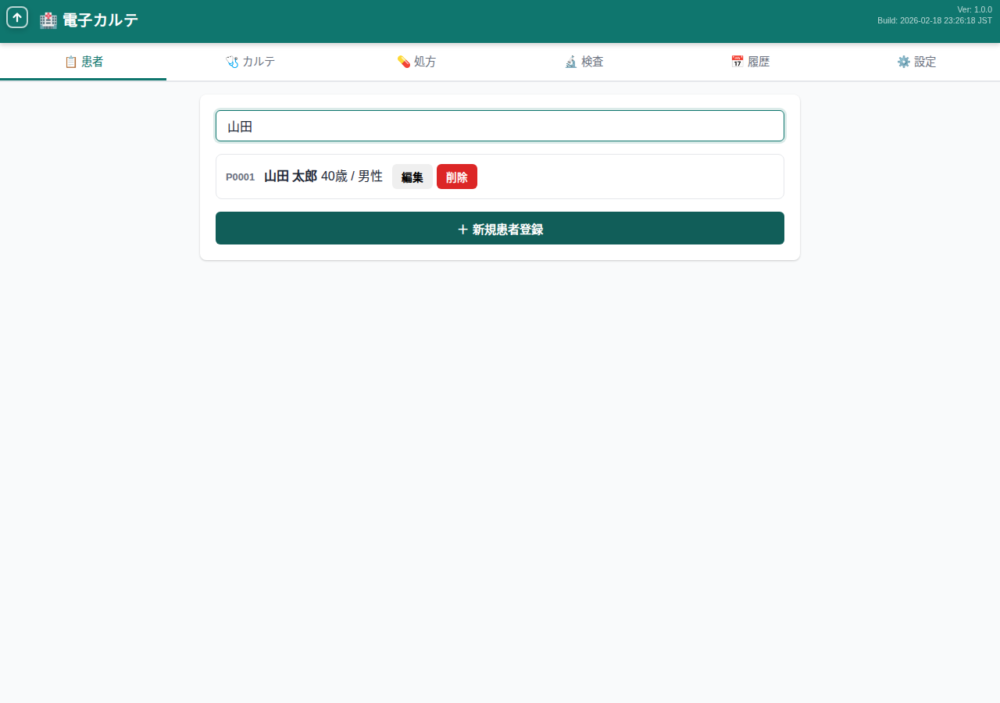
*「山田」で検索した結果。該当する患者のみ表示されます。*

### 患者情報の編集

患者カードの「編集」ボタンをクリックすると、登録時と同じフォームが表示され、情報を修正できます。

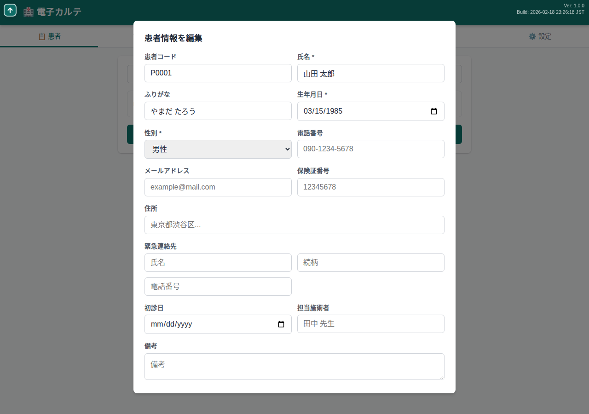
*既存の患者情報が読み込まれた編集フォーム。*

### 患者の削除

患者カードの「削除」ボタンをクリックすると、確認ダイアログが表示されます。

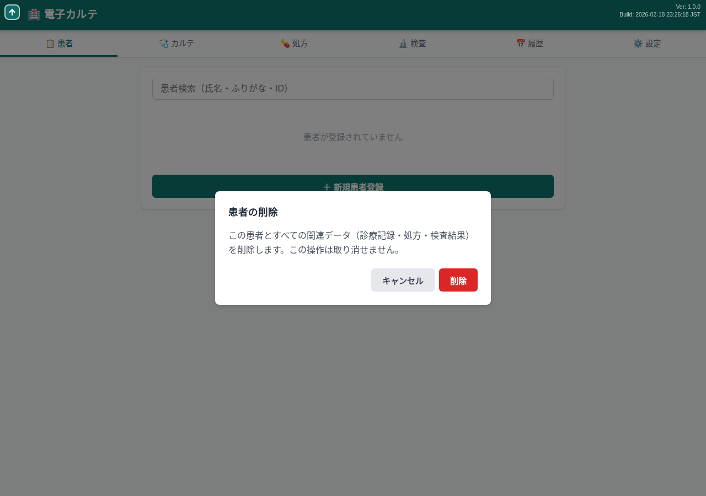
*削除確認ダイアログ。関連する診療記録・処方・検査結果もすべて削除されます。*

> **注意:** 削除は取り消せません。すべての関連データ（診療記録・処方・検査結果）も同時に削除されます。

---

## カルテ（診療記録）

### SOAP記録の入力

1. 患者タブで患者カードをクリックして患者を選択します。
2. 自動的にカルテタブに切り替わります。

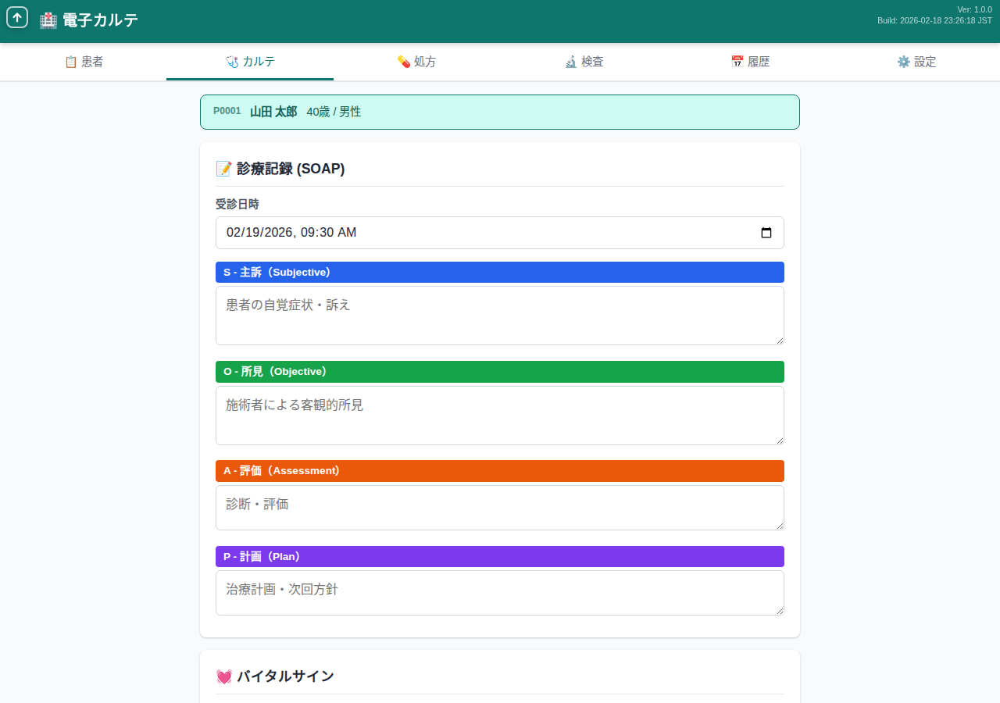
*患者選択後のカルテ画面。上部に患者情報バーが表示されます。*

3. SOAP形式で診療記録を入力します。

| セクション | 内容 |
|------------|------|
| **S - 主訴（Subjective）** | 患者の訴え、自覚症状 |
| **O - 所見（Objective）** | 診察所見、検査結果などの客観的情報 |
| **A - 評価（Assessment）** | 診断名、病態の評価 |
| **P - 計画（Plan）** | 治療方針、処方、検査予定 |

### バイタルサインの入力

SOAPの下にバイタルサイン入力欄があります。

| 項目 | 単位 |
|------|------|
| 体温 | ℃ |
| 収縮期血圧 / 拡張期血圧 | mmHg |
| 脈拍 | bpm |
| SpO2 | % |
| 呼吸数 | 回/分 |
| 体重 | kg |
| 身長 | cm |

### 写真添付

カルテに画像を添付できます。ドラッグ&ドロップまたは「ファイルを選択」ボタンから画像を追加します（最大5枚、JPEG自動変換）。

### 記録の保存と確認

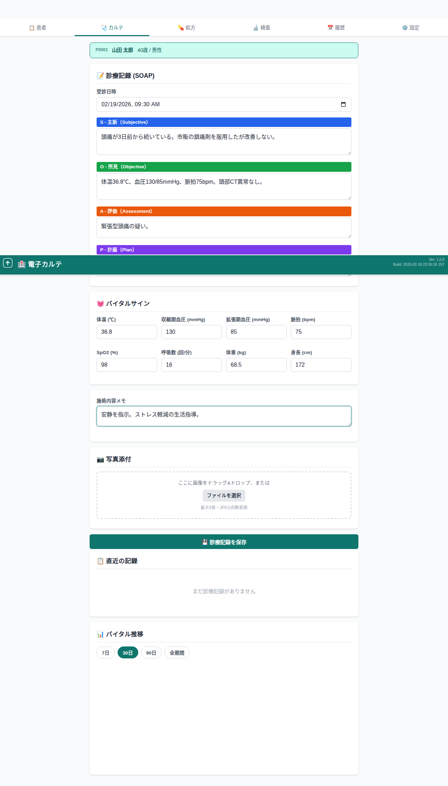
*SOAP・バイタルサインを入力した状態。*

「診療記録を保存」ボタンをクリックすると記録が保存されます。

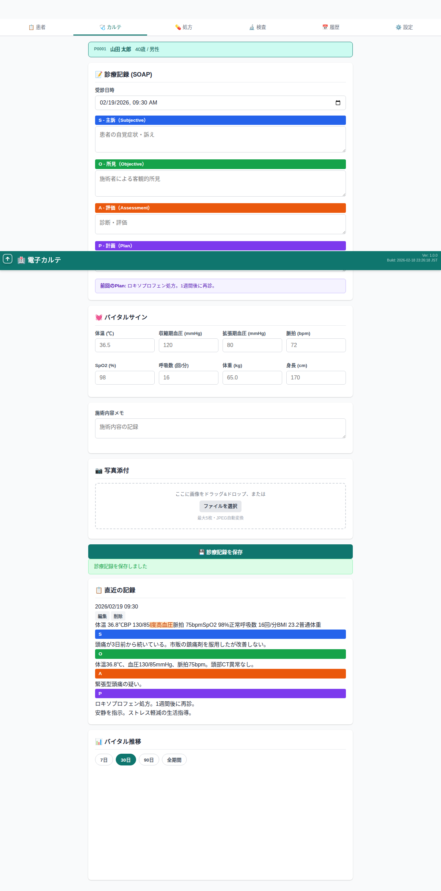
*保存後、「直近の記録」セクションに保存した記録が表示されます。*

ページ下部には「バイタル推移」グラフがあり、7日/30日/90日/全期間で切り替えて推移を確認できます。

---

## 処方管理

### 処方の入力

処方タブでは、選択中の患者への処方を入力します。

| 項目 | 説明 |
|------|------|
| 処方日 | 処方日（デフォルト：本日） |
| 薬剤名 | 薬の名前（必須） |
| 用量 | 1回あたりの服用量 |
| 用法 | 服用タイミング（例：毎食後） |
| 処方日数 | 投薬日数 |
| 備考 | 注意事項など |

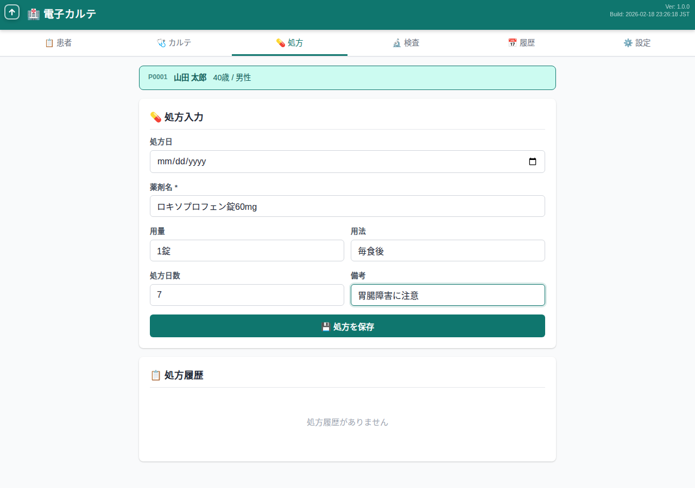
*処方情報を入力した状態。*

### 処方履歴

保存した処方は「処方履歴」セクションに一覧表示されます。各処方の「編集」「削除」ボタンで修正・削除が可能です。

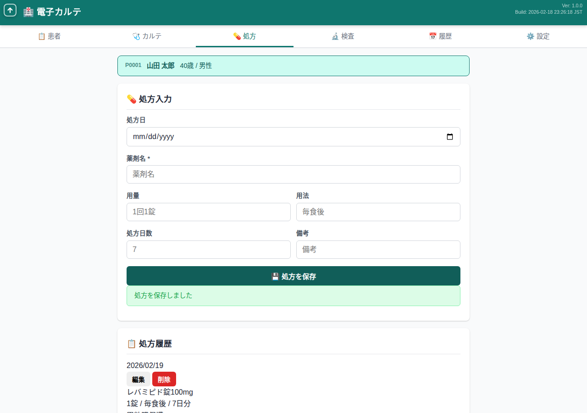
*保存済みの処方一覧。薬剤名・用量・用法・日数が確認できます。*

---

## 検査結果

### 検査結果の入力

検査タブで検査結果を入力します。

| 項目 | 説明 |
|------|------|
| 検査日 | 検査実施日 |
| カテゴリ | 血液検査 / 尿検査 / 画像 / その他 |
| 検査項目名 | 検査名称（必須） |
| 検査値 | 結果数値（必須） |
| 単位 | 値の単位 |
| 基準値下限 / 上限 | 基準範囲（自動判定に使用） |
| 判定 | 自動判定 / 手動選択（正常/異常/要注意） |
| 備考 | 補足情報 |

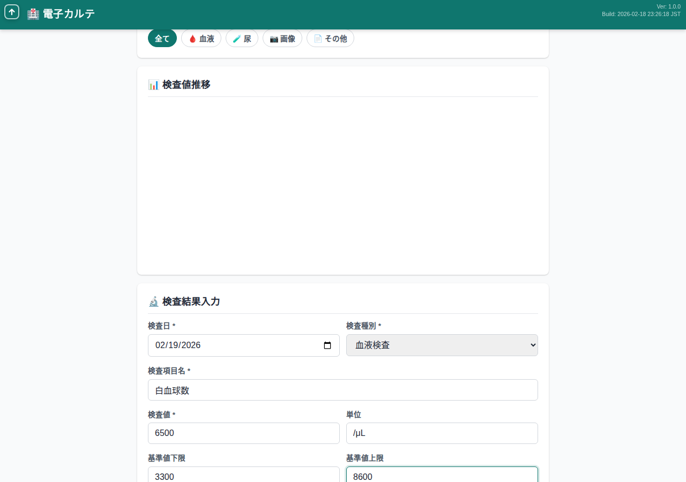
*検査結果の入力例。基準値を設定すると自動で正常/異常を判定します。*

### 検査結果一覧

保存された検査結果は「検査結果一覧」に表示されます。異常値はハイライト表示されます。

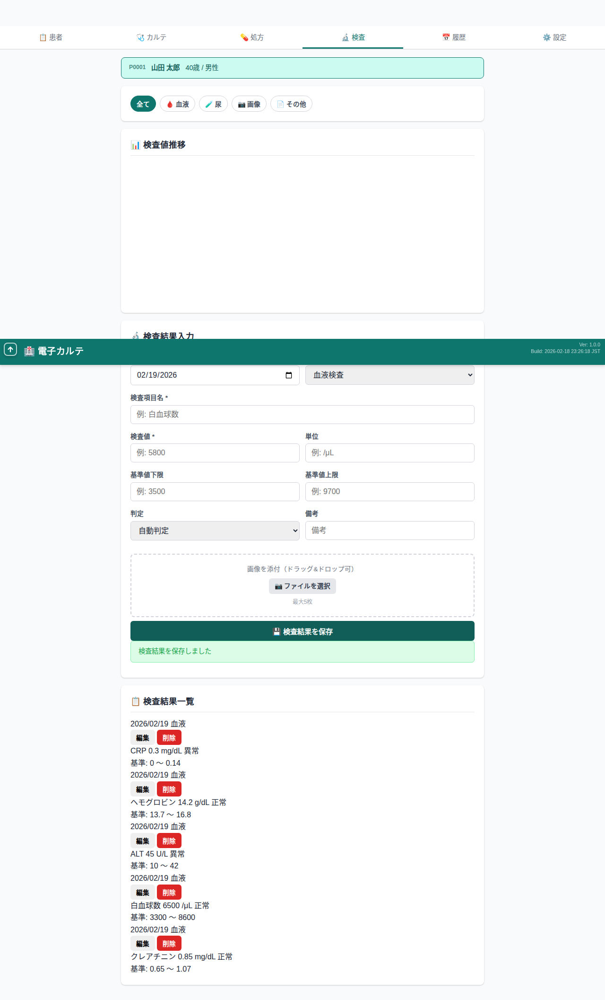
*複数の検査結果が一覧表示されます。基準値超過の項目は「異常」と表示されます。*

### カテゴリフィルタ

検査結果一覧の上部にあるフィルタボタンで、カテゴリ別に表示を絞り込めます。

| ボタン | 表示対象 |
|--------|----------|
| 全て | すべての検査 |
| 🩸 血液 | 血液検査 |
| 🧪 尿 | 尿検査 |
| 🏥 画像 | 画像検査 |
| その他 | その他の検査 |

ページ上部の「検査値推移」セクションでは、検査値の経時変化をグラフで確認できます。

---

## 診療履歴

履歴タブでは、選択中の患者に関するすべての診療情報（カルテ・処方・検査）を時系列で確認できます。

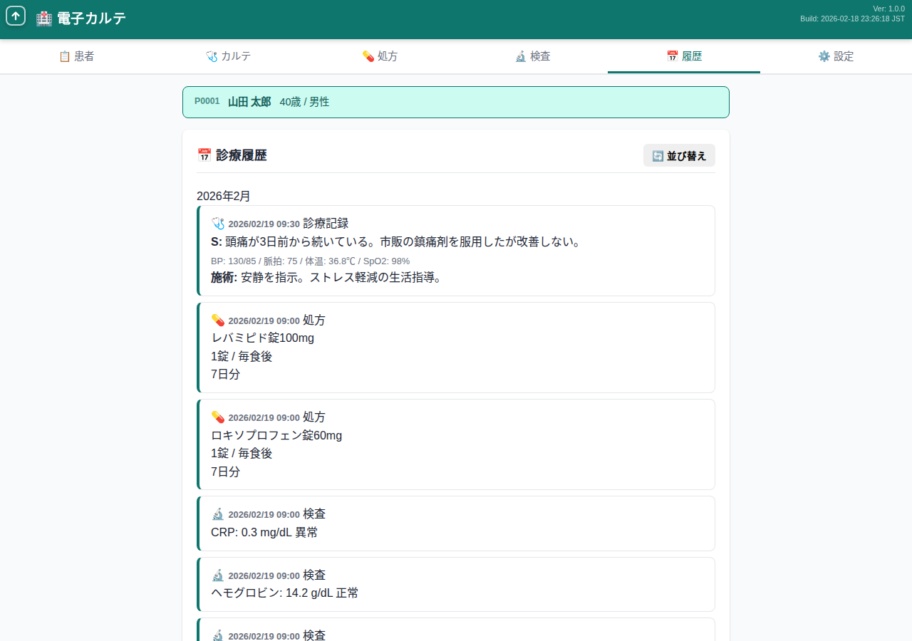
*タイムライン形式で診療記録・処方・検査結果が統合表示されます。*

**機能：**
- 月別にグループ化表示
- 「並び替え」ボタンで昇順/降順切替
- 各エントリにはアイコンで種別（🩺 診療記録 / 💊 処方 / 🔬 検査）が表示されます

---

## 設定

設定タブでは、データ管理やAI診断の設定を行います。

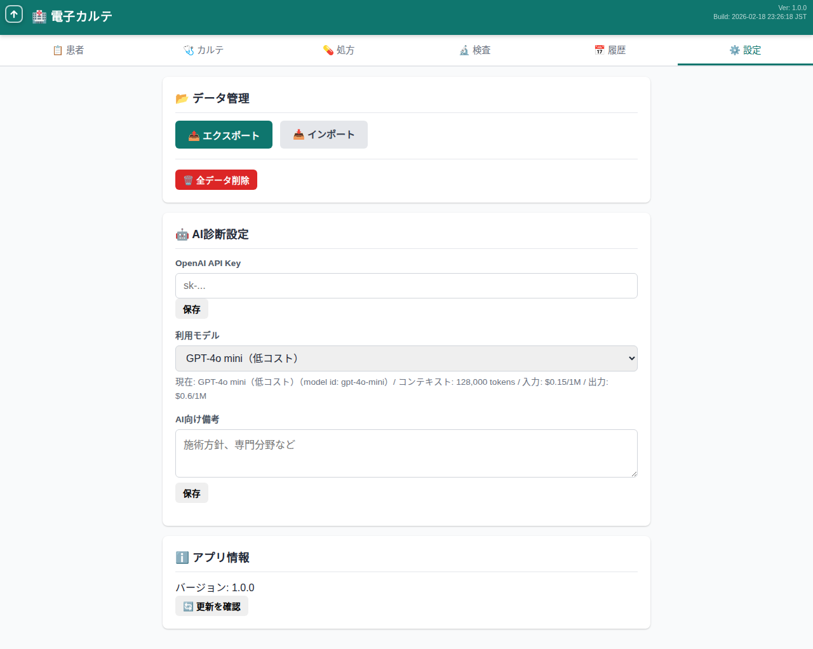
*設定タブ。データ管理、AI設定、バージョン情報が表示されます。*

### データ管理（エクスポート/インポート）

| 機能 | 説明 |
|------|------|
| エクスポート | すべてのデータをJSON形式でダウンロード |
| インポート | JSONファイルからデータを復元（既存データとマージ） |
| 全データ削除 | すべてのデータを削除（確認ダイアログあり） |

> **バックアップ推奨:** 定期的にエクスポートを実行し、データのバックアップを取ることを推奨します。

### AI診断設定

OpenAI APIキーを設定すると、AI診断支援タブが有効になります。

| 項目 | 説明 |
|------|------|
| OpenAI API Key | OpenAIのAPIキー（sk-で始まる文字列） |
| 利用モデル | 使用するAIモデル（GPT-4o mini推奨） |
| AI向け備考 | 施術方針・専門分野などAIに伝える補足情報 |

---

## データの保存について

- すべてのデータはブラウザの **IndexedDB** に保存されます
- サーバーへの通信は行いません（AI診断使用時を除く）
- ブラウザのデータを削除するとアプリのデータも失われます
- **定期的なエクスポートによるバックアップを強く推奨します**
- PWAとしてインストールすると、ホーム画面からアプリとして起動できます
